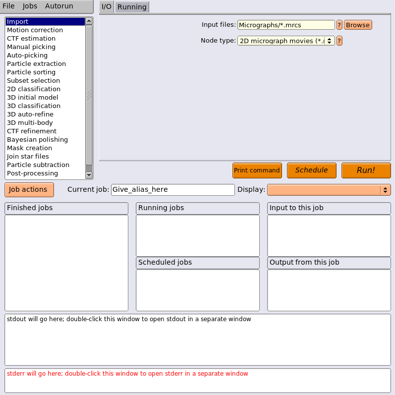

# RELION

RELION (**Re**gularized **Li**kelihood **O**ptimizatio**n**) is software developed for single-particle cryo-electron microscopy analysis. It was written by S. Scheres and presented in the 2012 paper [RELION: Implementation of a Bayesian approach to cryo-EM structure determination](https://doi.org/10.1016/j.jsb.2012.09.006).

The RELION 3.0 tutorial document is a helpful resource. It is available [here](ftp://ftp.mrc-lmb.cam.ac.uk/pub/scheres/relion30_tutorial.pdf), and is [reproduced in this repo](/resources/relion30_tutorial.pdf) in case that resource becomes unavailable.

## Background

## Pipeline

This section takes the user through a sample RELION pipeline, from importing image and coordinate data to a refined 3D reconstruction. Helical particle reconstruction (which RELION is capable of) is not discussed here. Much more detail (nearly 60 pages) is provided on all available jobs in the RELION 3.0 tutorial PDF linked at the top of this document.

### Project Directory

A RELION pipeline lives inside of its project directory, which will be set up automatically in the current directory the first time the `relion` command is run (in that directory). Start by creating that directory and `cd`ing to it.

```shell script
mkdir path/to/new-project-dir
cd path/to/new-project-dir
```

Because much of RELION's file handling is based on paths relative to the project directory, it is recommended to copy or link the required resources (micrograph images and corresponding STAR coordinate files) before proceeding with `Import` jobs. Feel free to replace `ln` with `cp`, `ln -s`, etc., as appropriate.

```shell script
ln path/to/*.mrc .
ln path/to/*.star .
```

The RELION GUI can now be launched. Note that RELION requires that your user has write permissions in the current directory. If viewing another's project directory, to which you do not have access, use `relion --readonly` instead.

```shell script
relion
```

When prompted to create a new project directory, answer `y`.

### The GUI

As of RELION 3.0, the GUI consists of three sections.



The left panel contains jobs (commands) that can be run. Once a job is selected, the center panel contains parameters for that job, which are split into categories via the tabs at the top. Below the center panel are a number of controls:

- `Run!` executes the job selected in the left panel with the parameters set in the center panel immediately, sending it to the `Running jobs` list in the bottom panel.
- `Schedule` is similar to `Run`, but sends the job to `Scheduled jobs`. This list acts as a queue, holding a series of jobs, allowing them to be executed one after another via the `Autorun` menu (top left of the GUI).
- `Print command` sends to your shell's stdout the command that would be run (or sent to a job scheduler) had you pressed the `Run` button.

Once a job has been configured and run with the top half of the GUI, the panels in the bottom half become relevant.

- The `Current job` text box shows the name and path (relative to the project directory, as always) of the currently selected job. When configuring a job, it becomes editable to allow you to provide a job alias (instead of the standard `job001`, `job002`, etc.).
- The `Display` dropdown allows you to preview the inputs and outputs of the selected job in a grid format.
- The `Job actions` button allows you to clean up or delete the selected job. If space is available in your computing environment, it is recommended to wait to clean jobs (i.e., remove intermediate files) until you're finished with a particular pipeline, e.g., have obtained a satisfactory reconstruction.
- The `Input to this job` and `Output from this job` panels display the relative paths of other jobs which came directly before or after (respectively) this one in your pipeline. This can aid in organization.
- Once they have completed, jobs will move from `Running jobs` to `Finished jobs`. If a finished job is selected, the main center panel should change to reflect that job's parameters. As of RELION 3.0, it appears that this particular feature may occasionally not work properly (if relaunching RELION does not help, a job's parameters are always accessible in the `run.job` file in that job's directory). Also, after some types of jobs are finished, selecting them will cause the `Run!` to change to `Continue`. This means that (e.g., in the case of a job with many iterations), the latest successful iteration can be selected from the main panel and the job can continue from where it left off.
- The bottom two boxes should display stdout and stderr of the selected job, but this does not seem to work for jobs that are submitted to scheduling queues (see the `Running` tab when any job is selected).

### Import

_Elapsed wall time per job: second(s)_

Since we have already made micrographs and STAR files available in the project directory (see the [Project Directory](#project-directory) section), `job001` and `job002` are straightforward. Tables like the following will be used to describe jobs. For the sake of readability, only values that probably need to be changed are included; the rest were left at RELION 3.0 defaults. User-specific and/or data-specific values are indicated by `???`, with recommended values in parentheses, and described in the `Notes` column.

#### Import/job001

| Tab | Parameter | Value | Notes |
| --- | --- | --- | --- |
| I/O | Input files | *.mrc |
| I/O | Node type | 2D micrographs/tomograms (*.mrc) |

#### Import/job002

| Tab | Parameter | Value | Notes |
| --- | --- | --- | --- |
| I/O | Input files | *.star |
| I/O | Node type | 2D/3D particle coordinates (*.box, *_pick.star) | STAR files should be named the same as their corresponding micrographs, with an optional suffix, e.g., `_pick`. |

### CTF Estimation

_Elapsed wall time per job: ~1-2 minutes (note that all time estimates may vary widely depending on compute resource availability and data set size)_

CTF ([Contrast Transfer Function](https://en.wikipedia.org/wiki/Contrast_transfer_function)) correction is applied to the imported micrographs (`job002` above) in order to account for aberrations in phase-contrast microscopy.

#### CtfFind/job003

| Tab | Parameter | Value | Notes |
| --- | --- | --- | --- |
| I/O | Input micrographs STAR file | Import/job001/micrographs.star |
| I/O | Voltage (kV) | ??? | Voltage of microscope that took the source micrographs |
| I/O | Magnified pixel size (Angstrom) | ??? | Pixel size of source micrographs in Angstroms |
| Searches | FFT box size (pix) | ??? (512) | Side length of a box around the central part of the micrographs' Fourier transforms, outside which amplitudes are ignored |
| Searches | Maximum resolution (A) | ??? (15) |
| CTFFIND-4.1 | Use CTFFIND-4.1 | Yes | In this example, CTFFIND is used instead of Gctf |
| CTFFIND-4.1 | CTFFIND-4.1 executable | ??? | Path to the `ctffind` binary |
| Running | Number of MPI procs | ??? | Recommended compute resources: CPU node, ≥ 5G memory.
| Running | Submit to queue? | (Yes/No) | If you have private partitions available, change to `Yes` for RELION to automatically request the required computing resources.
| Running | Queue name | ??? | If `Submit to queue?` is `Yes`, for Gerstein, use `pi_gerstein_gpu`.
| Running | Queue submit command | ??? | If `Submit to queue?` is `Yes`, for all of Farnam using SLURM, use `sbatch`.

Optionally, you may wish to inspect the CTF-corrected micrographs via `Display > out: micrographs_ctf.star`. Wait for a popup with display parameters to appear, change `Scale` and the sort options as needed, and click `Display!`. If any CTF-corrected micrographs look vastly different from the rest (distortions, etc.), you may wish to filter these out via [Subset Selection](#subset-selection). If not, feel free to proceed to [Particle Extraction](#particle-extraction)

If needed, the `Select` job would be configured as follows:

| Tab | Parameter | Value | Notes |
| --- | --- | --- | --- |
| I/O | OR select from micrographs.star | CtfFind/job003/micrographs_ctf.star |

Wait for the display popup, change parameters as needed, and click `Display!`. Left click to select the poorly-corrected micrographs (selected micrographs become outlined in red), then right click on one of them, choose `Invert selection`, right click again, and choose `Save micrographs`.

### Particle Extraction

_Elapsed wall time per job: ~5 minutes_

`Extract` uses your source coordinate files to extract particle images from your micrographs.

#### Extract/job004

| Tab | Parameter | Value | Notes |
| --- | --- | --- | --- |
| I/O | Micrograph STAR file | CtfFind/job003/micrographs_ctf.star |
| I/O | Input coordinates | Import/job002/coords_suffix*.star | Here, * can be the empty string, or can be replaced with a STAR file suffix (e.g., `_pick`), as per `job002`. |
| Extract | Particle box size (pix) | ??? | Must be an even number, and should follow EMAN standards* for ideal performance. |
| Extract | Invert contrast | (Yes/No) | For cryo-EM data (dark particles on light background), keep `Yes`; for negative stain data (light particles on dark background, change to `No`; the goal is to obtain white particles in all cases. |
| Extract | Rescale particles | (Yes/No) |
| Extract | Re-scaled size (pixels) | ??? | If `Rescale particles` is `Yes`, calculate this value from `Particle box size` by dividing by, e.g., 2, 4, 8, etc. |
| Running** | Number of MPI procs | 5 |

*According to [EMAN2 box size standards](https://blake.bcm.edu/emanwiki/EMAN2/BoxSize), the particle box size should be selected from the following list for optimal performance:

> 16, 24, 32, 36, 40, 44, 48, 52, 56, 60, 64, 72, 84, 96, 100, 104, 112, 120, 128, 132, 140, 168, 180, 192, 196, 208, 216, 220, 224, 240, 256, 260, 288, 300, 320, 352, 360, 384, 416, 440, 448, 480, 512, 540, 560, 576, 588, 600, 630, 640, 648, 672, 686, 700, 720, 750, 756, 768, 784, 800, 810, 840, 864, 882, 896, 900, 960, 972, 980, 1000, 1008, 1024

**Recommended compute resources: CPU node, ≥ 5G memory

### 2D Classification

_Elapsed wall time per job: ~15 minutes_

#### Class2D/job005

| Tab | Parameter | Value | Notes |
| --- | --- | --- | --- |
| I/O | Input images STAR file | Extract/job004/particles.star |
| CTF | Ignore CTFs until first peak | (Yes/No) | Keep `No` unless you know that 2D classes of this data set tend to look "blurry" or "out of focus". |
| Optimisation | Number of classes | ??? | e.g., `50`
| Optimisation | Use fast subsets (for large data sets) | Yes |
| Optimisation | Mask diameter (A) | ??? |
| Compute | Number of pooled particles | 30 |
| Compute | Use GPU acceleration | Yes* |
| Compute | Which GPUs to use | | If left empty, RELION will choose one to use. On an NVIDIA system, `nvidia-smi` can be run to obtain GPU information. |
| Running** | Number of MPI procs | 5 |
| Running** | No. of GPUs/node | ??? | Should be as many as is reasonable; e.g., `4` seems to work well on our computing cluster |

*If a GPU is unavailable, Class2D can be run on CPU only, but it will take much longer.

**Recommended compute resources: CPU+GPU node, ≥ 5G memory, ≥ 1 GPU

### Subset Selection

_Elapsed wall time per job: N/A_

`Select` is not a computation job; rather, it allows for visual inspection and filtering of the outputs of other jobs.

#### Select/job006

| Tab | Parameter | Value | Notes |
| --- | --- | --- | --- |
| I/O | Select classes from model.star | Class2D/job005/run_it*_mode.star | Here, * should be replaced by the maximum iteration number from `job005` (`25` by default).

Wait for the display popup, change parameters as needed, and click `Display!`. Left click to select the best 2D classes (selected classes become outlined in red). To view a class's metadata, right click on it and choose `Show metadata this class`. To save your selections, right click on one of them and choose `Save selected classes`.

### 3D Initial Model

_Elapsed wall time per job: hour(s) (again, this may vary widely depending on data set size, whether particle extraction was done with downscaling, iteration count, etc.)_

#### InitialModel/job007

| Tab | Parameter | Value | Notes |
| --- | --- | --- | --- |
| I/O | Input images STAR file | Select/job006/particles.star |
| Optimisation | Number of classes | 2 | Asking for two 3D classes gives RELION the opportunity to use particles from "better" 2D classes for one and vice versa for the other. |
| Optimisation | Mask diameter (A) | ??? |
| Compute | Number of pooled particles | 4 |
| Compute | Use GPU acceleration | Yes* |
| Compute | Which GPUs to use | | If left empty, RELION will choose one to use. On an NVIDIA system, `nvidia-smi` can be run to obtain GPU information. |
| Running* | Number of MPI procs | 2 |
| Running* | No. of GPUs/node | 1 |

*Recommended compute resources: CPU+GPU node, ≥ 5G memory, ≥ 1 GPU

This job may take some time to complete. If at any point it runs out of memory, RELION can resume the job, continuing from its most recent saved iteration. To do this, select the job, click `Browse` next to `I/O > Continue from here`, select the latest saved iteration, and click `Continue`.

#### Chimera

Once it completes, the initial 3D model can be previewed using molecular modeling software like UCSF Chimera ([download page](https://www.cgl.ucsf.edu/chimera/download.html)).

Here, it will be assumed that you have two 3D classes from the 300th iteration of `InitialModel` (e.g., `run_it300_class001.mrc` and `run_it300_class002.mrc`) available on the same machine as a Chimera executable. If you need to transfer these class `.mrc` files from a server to your local machine, you could do so via something like

```shell script
scp REMOTE_HOST:path/to/run_it300_class\*.mrc directory/to/copy/to/on/local/machine
```

Open Chimera and use `File > Open` or `Browse...` on the main screen to navigate to and `Control`-select both classes. The classes should now be displayed on top of each other. To tile them, go to `Tools > General > Command Line` and enter `tile` at the prompt.

Model manipulation shortcuts (for macOS):
 - Left-click-and-drag (or two-finger trackpad pan) to orbit
 - `Option`-left-click-and-drag to pan
    - Add `Shift` to do this slowly
 - `Command`-left-click-and-drag (or two-finger trackpad pinch) to zoom
    - Add `Shift` to do this slowly
 - `Control`-left-click-and-drag to make a selection

If the Volume Viewer window is not already open, open it via `Tools > Volume Data > Volume Viewer`.
 - Use the vertical slider bar to change the threshold on each histogram and remove noise.
 - A volume can be removed entirely from the current scene with the `-` button in the Volume Viewer, and hidden with the `👁` (eye) button.
 - To remove a mass from the displayed volume, use the Volume Eraser (`Tools > Volume Data > Volume Eraser`). Move the pink deletion sphere by middle-clicking-and-dragging (mouse button can be changed via dropdown), and click `Erase` when satisfied with its position.
 - A volume can be activated by clicking its name. Once active, it can be saved with `File (in the Volume Viewer) > Save map as...`.

### Mask Creation (optional)

#### MaskCreate/job008


### 3D Auto-Refine

#### Refine3D/job009

| Tab | Parameter | Value | Notes |
| --- | --- | --- | --- |
| Running | Number of MPI procs | 3 |
